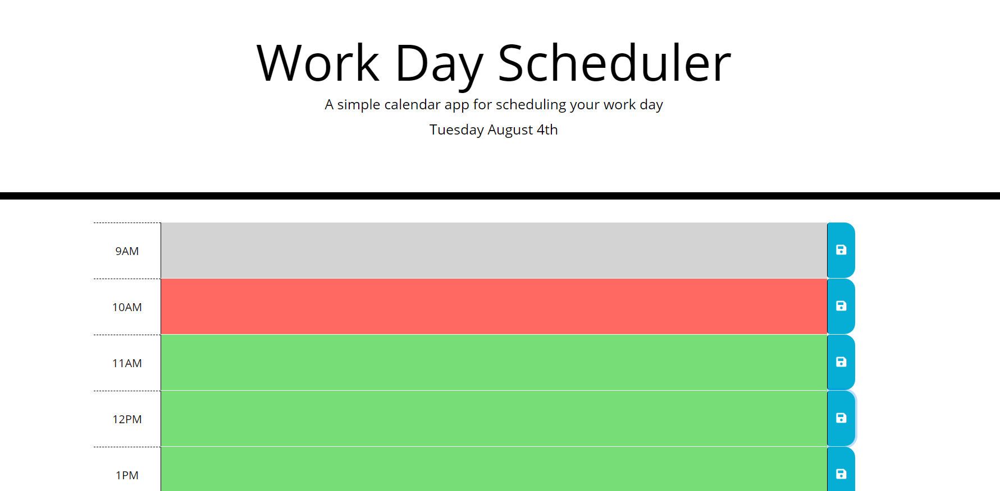
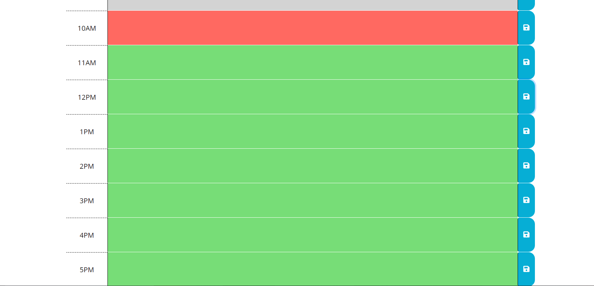

# 05 Third-Party APIs: Work Day Scheduler

This site is a simple calendar application that allows the user to save their schedule for each hour of the day. 
This app is run in the browser and uses dynamically updated HTML & CSS through the use of jQuery. 
The calendar's date and time is powered by the [Moment.js] library. 

## Deployed Applcation

```
https://arbarber0510.github.io/workdayschedule/
```

## Acceptance Criteria

```
GIVEN I am using a daily planner to create a schedule
WHEN I open the planner
THEN the current day is displayed at the top of the calendar
WHEN I scroll down
THEN I am presented with timeblocks for standard business hours
WHEN I view the timeblocks for that day
THEN each timeblock is color coded to indicate whether it is in the past, present, or future
WHEN I click into a timeblock
THEN I can enter an event
WHEN I click the save button for that timeblock
THEN the text for that event is saved in local storage
WHEN I refresh the page
THEN the saved events persist
```

The following screenshots reflects the application functionality:





